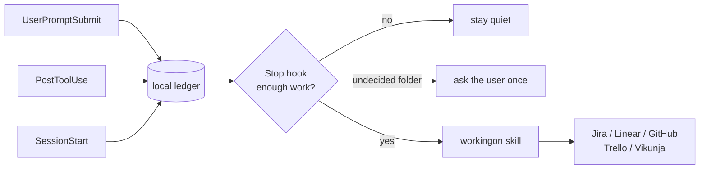

<div align="center">

# workingon

**Claude Code records what you work on into your ticketing tool, automatically.**

[](https://github.com/oliverjueguen/skill-claude-workingon/releases)
[](LICENSE)
[](https://nodejs.org)
[](https://developer.mozilla.org/docs/Web/JavaScript)
[](package.json)
[](test/run.mjs)
[](https://claude.com/claude-code)

[](#supported-tools)
[](#supported-tools)
[](#supported-tools)
[](#supported-tools)
[](#supported-tools)

</div>

---

> **It writes nothing until you say so.** Simulation mode is on by default: every intended write is logged to a file so you can read exactly what would have happened before a single ticket is created. Unmapped folders write nowhere, labels are never invented, and private folders can be excluded so nothing is captured even locally.
>
> That matters because the first place you will try this is probably your company's Jira.

## What it does

You work. Hooks quietly note what you asked for, which files changed, which commands ran and which commits landed. When a turn ends and that adds up to real work, the matching ticket is created or updated.

```
you work  ->  hooks capture  ->  enough work?  ->  Claude writes the ticket
                (local ledger)      (thresholds)      (or a progress comment)
```

No ticket for a question. No ticket for two typos. One ticket per task, and later work on the same task becomes a short comment on it rather than a second ticket.

## Why a skill and hooks together

A skill alone depends on the model remembering to invoke it. A hook alone cannot write a ticket a human wants to read. Each does what it is good at.

| Part | Job | Why it is right for the job |
|---|---|---|
| **Hooks** | Capture | Deterministic, cheap, and they never break a session |
| **The skill** | Write | Has the whole conversation, so titles and bodies read well |
| **`Stop` hook** | Decide | Notices unrecorded work and hands the decision to Claude |



## Supported tools

| Tool | Container | Body format | Notable constraint |
|---|---|---|---|
| **Jira** | project key | wiki markup | REST v2 on purpose: v3 demands Atlassian Document Format |
| **Linear** | team | markdown | API key goes in `Authorization` raw, no `Bearer` prefix |
| **GitHub Issues** | `owner/repo` | markdown | Issues cannot be deleted through the API, only closed |
| **Trello** | list | markdown | No real "done", so closing archives the card |
| **Vikunja** | project | HTML | PUT creates and POST updates, and update replaces the task |

Adding a sixth is one file implementing the contract in [`src/providers/base.mjs`](src/providers/base.mjs).

## Install

```bash
git clone https://github.com/oliverjueguen/skill-claude-workingon.git
cd skill-claude-workingon
node install.mjs
node ~/.claude/workingon/bin/workingon.mjs setup
```

Setup is three steps:

<table>
<tr><td><b>1. Token</b></td><td>Pick your tool. It prints where to get a token for that specific one, then verifies the credentials before saving anything.</td></tr>
<tr><td><b>2. Behaviour</b></td><td>Record everywhere automatically, or ask once per project. Who writes the text. Whether to start in simulation.</td></tr>
<tr><td><b>3. Destination</b></td><td>Which project, board, repository or team tickets land in, and the label that marks them.</td></tr>
</table>

Every step also runs unattended:

```bash
workingon setup --step 1 --provider linear --token lin_api_xxx
workingon setup --step 2 --mode ask --write-style nudge
workingon setup --step 3 --container team_abc --label Claude
```

Restart Claude Code so the hooks load, then `workingon doctor` to confirm.

Uninstall with `node install.mjs --uninstall`. Hooks and skill go, config and history stay.

## Daily use

Normally nothing: work, and the ticket appears.

| Command | Effect |
|---|---|
| `/workingon` | Record what is pending now |
| `/workingon new <topic>` | Force a new ticket |
| `/workingon done` | Close this session's ticket |
| `/workingon link 42` | Link the session to an existing ticket |
| `/workingon status` | What is pending, and where it would go |
| `/workingon skip` | Drop the pending work without recording it |
| `/workingon doctor` | Diagnose configuration and connection |

## Modes

**`mode`** decides whether you get asked:

- **`ask`** (default): the first time work piles up in a new folder you are asked once, and the answer is remembered. Best if any project is private.
- **`autosave`**: record everywhere, using the default destination.
- **`off`**: capture nothing.

**`writeStyle`** decides who writes:

- **`nudge`** (default): Claude writes it with the full session context. Better wording, at the cost of an occasional extra turn.
- **`silent`**: the hook writes a factual entry itself and never interrupts.

## Private projects

```bash
workingon config --exclude <folder>
```

Nothing from that folder is sent **and nothing is captured locally either**. The prompt and tool hooks return before writing, `SessionStart` creates no state, and whatever had already been captured is deleted.

Blocking only the upload would not be enough: your prompts and file names would still pile up in a ledger on disk, which for a private project is nearly as bad. Exclusion also beats any mapping, so an old `--map` cannot resurrect it.

## Secrets

Everything captured passes through a redactor before touching disk, at three separate points: capturing the prompt, capturing the command, and again in the client just before any write.

Recognised: Vikunja, JWT, GitHub, Anthropic, OpenAI, AWS, Slack and Google tokens, `Authorization` headers, credentials inside a URL, private key blocks, and assignments like `API_KEY=...`.

Deliberately left alone: git shas, file paths, and prose that merely mentions the word password. A redactor with false positives gets switched off, so rules are anchored to recognisable prefixes rather than to "long hex string".

## Ticket shape

Bodies are capped at 600 characters and comments at 400, enforced by `create`, `update` and `comment`. Over the limit is **rejected, not truncated**: cutting text loses information silently, and the point is to make the writer summarise.

```markdown
Migrate session auth to JWT

Cookie sessions kept state in memory and blocked running more than one instance.

- Token issue and verify in `src/auth/jwt.ts`
- Authorisation middleware adapted

Pending: revoke refresh tokens on sign out
```

## Project layout

```
src/providers/   one adapter per tool, plus the shared contract
src/lib/         config, ledger, markdown conversion, redaction, SpecKit
src/bin/         the command line interface
src/hooks/       session-start, user-prompt, post-tool, stop, session-end
skill/           SKILL.md and reference.md
test/            mocked APIs for all five tools, and the suite
```

| | |
|---|---|
| Language | JavaScript, ES modules, ~4,600 lines |
| Runtime | Node.js 18 or newer |
| Dependencies | None |
| Tests | 180 checks, no network |

## Tests

```bash
npm test
```

A mock server impersonates all five APIs at once, including their quirks: it rejects Atlassian Document Format on Jira, rejects a `Bearer` prefix on Linear, mixes pull requests into GitHub issue listings, and truncates pages on Vikunja.

Half the suite is a contract every provider must satisfy, run five times over: create, read, comment, delete a comment, search, close, never invent labels, respect simulation. The rest covers the hooks, redaction, brevity and per folder decisions.

## Configuration

`workingon config` prints the current configuration with secrets masked. See [`config.example.json`](config.example.json) for every key, and [`skill/reference.md`](skill/reference.md) for the full command and error reference.

Credentials can also come from the environment, which keeps them out of the file entirely:

```bash
export WORKINGON_PROVIDER=linear
export WORKINGON_LINEAR_TOKEN=lin_api_xxx
```

## SpecKit

If a repository uses [SpecKit](https://speckit.org), the active feature is detected from the git branch and surfaced at session start.

## License

[MIT](LICENSE)
